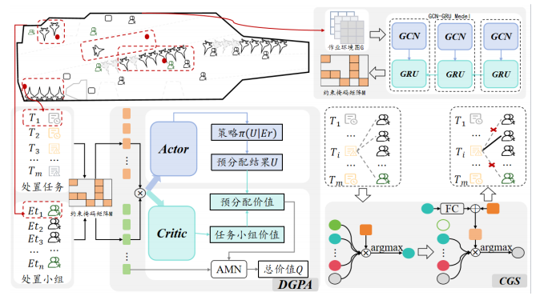

# 面向航母舰面特情处置的保障应急决策方法
论文《面向航母舰面特情处置的保障应急决策方法》的官方代码。该仓库含我们算法的环境、代码以及数据集。

## 1. 要求
执行以下命令安装必要依赖。
```
git clone https://github.com/liangtian66668888-del/ShipCode.git
cd ShipCode
pip install -r requirements.txt
```
## 2. 算法方法（RDSE）
RDSE（Resource Dynamic Scheduling for Emergency）算法由三部分构成：

### 3.1 特情扩散预测
基于 GCN + GRU 建模特情在舰面空间和时间维度上的扩散趋势，
预测潜在高风险区域，并将其作为前瞻性约束引入调度决策过程。

### 3.2 处置小组预分配（DGPA）
- 基于 SAC-Discrete
- 引入注意力机制
- 为每个特情处置小组预分配候选任务
- 支持任务数量与处置小组数量动态变化

### 3.3 候选小组筛选
基于 seq2seq 思想，从候选处置小组中逐步选择满足资源需求的最优组合，
避免局部最优和短视决策。

---

## 4. 代码结构
```text
├── main_ShipEnv.py              # 训练入口
├── allocation_ShipEnv.py        # 舰面仿真环境（核心）
├── manager.py                   # 高层调度决策（SAC + Attention）
├── worker.py                    # 处置小组（执行层）
├── preAssign.py                 # 预分配模块（DGPA）
├── utils.py                     # 工具函数
```

---

## 5. 强化学习环境设计
### 5.1 状态
- 处置小组状态（位置、资源、空闲/占用）
- 待执行任务状态（类型、位置、资源需求）
- 舰面空间与风险信息

### 5.2 动作
为处置小组分配待执行任务（保障任务或特情处置任务）。

### 5.3 奖励函数
奖励函数由两部分构成：
- **rbf_reward**：基于距离与风险的 dense shaping 奖励
- **task_reward**：任务完成奖励（sparse）


其中 `scale` 用于控制 dense reward 的尺度（如 0.01），以提升训练稳定性。

---

## 6. 训练方式
```bash
python main_ShipEnv.py
```

- `manager_return`：强化学习实际使用的累计回报
- `total_return`：环境返回的总奖励
- `length`：episode 步数（小于最大步数表示任务提前完成）
### 6.1 训练demo
```bash
python ShipEnv.py
```
---

## 7. 实验指标
主要评价指标包括：
- **原任务完成率**：衡量特情处置对原保障作业的干扰程度
- **物资损失率**：衡量调度策略对特情损失的抑制能力
- **平均累计回报**：反映训练效率与稳定性

论文实验结果表明，RDSE 在多种场景下均显著优于 PPO、A2C 及消融模型。

---